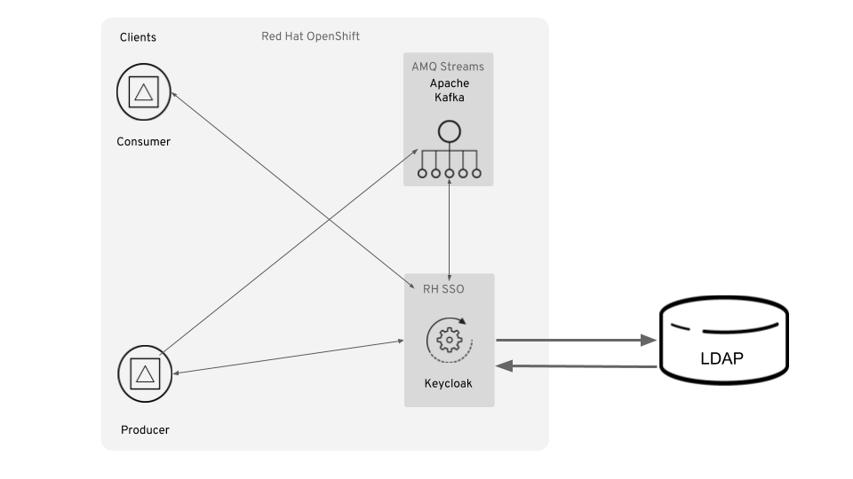

# AMQ Streams (Kafka) RBAC Enforcement with OAUTH2 and LDAP

This project demonstrates how to setup and configure an AMQ Streams cluster on OpenShift with client RBAC enforcement (authentication only) using RH-SSO (Keycloak).



## Prerequisites

The following product / OS prerequisities exist:

* OpenJDK 1.8+
* OpenShift 3.11.x
* An LDAP server.  If you don't have an LDAP server, follow this [procedure](https://hub.docker.com/r/larrycai/openldap/) to install a Docker image with a pre-built LDAP server.  Additionally, follow this [tutorial](https://access.redhat.com/documentation/en-US/Fuse_ESB_Enterprise/7.1/html/ActiveMQ_Security_Guide/files/LDAP.html) to configure sample users / groups for your test.

## Procedure

### Setup RH-SSO with custom self-signed keystore / truststore for HTTPS and JGroups

To get things started, we need to install on RH-SSO on OCP.  For the purposes of this demo, I'm using the stateless option (ethemeral) and am creating my own keystore and truststore.

1. Via the CLI, create a new OCP project: `oc new-project streams-oauth`.

2. Via the CLI, enter the following to generate a CA certificate (using `password` as the PEM passphrase):

```
openssl req -new -newkey rsa:4096 -x509 -keyout xpaas.key -out xpaas.crt -days 365 -subj "/CN=xpaas-sso-demo.ca"
```

3. Via the CLI, generate a CA certificate for the HTTPS keystore (using `password` as the keystore password):

```
keytool -genkeypair -keyalg RSA -keysize 2048 -dname "CN=oauth-demo.tiaa-ad83.open.redhat.com" -alias jboss -keystore keystore.jks
```

4. Generate a CSR for the HTTPS keystore (using `password` as the keystore password):

```
keytool -certreq -keyalg rsa -alias jboss -keystore keystore.jks -file sso.csr
```

5. Sign the CSR using `password`:

```
openssl x509 -req -CA xpaas.crt -CAkey xpaas.key -in sso.csr -out sso.crt -days 365 -CAcreateserial
```

6. Import the the CA certificate into the HTTPS keystore:

```
keytool -import -file xpaas.crt -alias xpaas.ca -keystore keystore.jks
```

7. Import the signed CSR into the HTTPS keystore (using `password` as the keystore password):

```
keytool -import -file sso.crt -alias jboss -keystore keystore.jks
```

8. Generate a secure key for the JGroups keystore:

```
keytool -genseckey -alias secret-key -storetype JCEKS -keystore jgroups.jceks
```

9. Import the CA cert into a new SSO truststore (using `password` as the keystore password):

```
keytool -import -file xpaas.crt -alias xpaas.ca -keystore truststore.jks
```

10. Create the secrets for the HTTPS and JGroups keystores:

```
oc secret new sso-app-secret keystore.jks jgroups.jceks truststore.jks
```

11. Link the secrets to the default service account:

```
oc secrets link default sso-app-secret
```

12. You can verify the keystores using the following commands:

```
keytool -v -list -keystore keystore.jks | grep Alias
keytool -v -list -keystore jgroups.jceks -storetype jceks | grep Alias
```

13. Lastly, deploy RH-SSO:

```
oc new-app --template=sso73-https \
 -p HTTPS_SECRET="sso-app-secret" \
 -p HTTPS_KEYSTORE="keystore.jks" \
 -p HTTPS_NAME="jboss" \
 -p HTTPS_PASSWORD="password" \
 -p JGROUPS_ENCRYPT_SECRET="sso-app-secret" \
 -p JGROUPS_ENCRYPT_KEYSTORE="jgroups.jceks" \
 -p JGROUPS_ENCRYPT_NAME="secret-key" \
 -p JGROUPS_ENCRYPT_PASSWORD="password" \
 -p SSO_ADMIN_USERNAME="admin" \
 -p SSO_ADMIN_PASSWORD="password" \
 -p SSO_TRUSTSTORE="truststore.jks" \
 -p SSO_TRUSTSTORE_PASSWORD="password" \
 -p SSO_TRUSTSTORE_SECRET="sso-app-secret"
```

14. You should receive the following output via the CLI:

```
--> Deploying template "openshift/sso73-https" to project streams-oauth

     Red Hat Single Sign-On 7.3 (Ephemeral with passthrough TLS)
     ---------
     An example application based on RH-SSO 7.3 image. For more information about using this template, see https://github.com/jboss-container-images/redhat-sso-7-openshift-image/docs.

     A new RH-SSO service has been created in your project. The admin username/password for accessing the master realm via the RH-SSO console is admin/password. Please be sure to create the following secrets: "sso-app-secret" containing the keystore.jks file used for serving secure content; "sso-app-secret" containing the jgroups.jceks file used for securing JGroups communications; "sso-app-secret" containing the truststore.jks file used for securing RH-SSO requests.

     * With parameters:
        * Application Name=sso
        * Custom http Route Hostname=
        * Custom https Route Hostname=
        * Custom RH-SSO Server Hostname=
        * Server Keystore Secret Name=sso-app-secret
        * Server Keystore Filename=keystore.jks
        * Server Keystore Type=
        * Server Certificate Name=jboss
        * Server Keystore Password=password
        * Datasource Minimum Pool Size=
        * Datasource Maximum Pool Size=
        * Datasource Transaction Isolation=
        * JGroups Secret Name=sso-app-secret
        * JGroups Keystore Filename=jgroups.jceks
        * JGroups Certificate Name=secret-key
        * JGroups Keystore Password=password
        * JGroups Cluster Password=I4kq7RL8 # generated
        * ImageStream Namespace=openshift
        * RH-SSO Administrator Username=admin
        * RH-SSO Administrator Password=password
        * RH-SSO Realm=
        * RH-SSO Service Username=
        * RH-SSO Service Password=
        * RH-SSO Trust Store=truststore.jks
        * RH-SSO Trust Store Password=password
        * RH-SSO Trust Store Secret=sso-app-secret
        * Container Memory Limit=1Gi

--> Creating resources ...
    service "sso" created
    service "secure-sso" created
    service "sso-ping" created
    route.route.openshift.io "sso" created
    route.route.openshift.io "secure-sso" created
    deploymentconfig.apps.openshift.io "sso" created
--> Success
    Access your application via route 'sso-streams-oauth.apps.tiaa-ad83.open.redhat.com'
    Access your application via route 'secure-sso-streams-oauth.apps.tiaa-ad83.open.redhat.com'
    Run 'oc status' to view your app.
```

15. Once the RH-SSO pod starts up, you can access the Admin console via: `https://secure-sso-streams-oauth.apps.tiaa-ad83.open.redhat.com/auth/admin` and credentials u:admin p:password.

16. Import the kafka clients + broker configuration by clicking on `Manage > Import` and selecting the `conf/sso/realm-export.json` file.  Be sure to regenerate the secret for `kafka-broker`, `kafka-consumer` and `kafka-producer`.

### Install and configure AMQ Streams

Now that RH-SSO is installed and we have the OAUTH2 clients setup, we need to install and configure AMQ Streams.

1. Via the CLI, change to the `/conf/streams` directory.

2. Run the following command to update the namespace in each definition file:

```
sed -i '' 's/namespace: .*/namespace: streams-oauth/' install/cluster-operator/*RoleBinding*.yaml
```

3. Install the AMQ Streams cluster operator on OCP:

```
oc apply -f install/cluster-operator -n streams-oauth
```

4. Replace the <broker secret> with the client secret for `kafka-broker` in RH-SSO (on the *Credentials* tab), then execute the command via the CLI:

```
oc create secret generic broker-oauth-secret -n streams-oauth --from-literal=secret=<broker-secret>
```

5. Deploy the AMQ Streams Zookeeper and Kafka brokers (but update the `validIssuerUri` and `jwksEndpointUri` to match your *hostname*):

```
cat << EOF | oc create -f -
apiVersion: kafka.strimzi.io/v1alpha1
kind: Kafka
metadata:
  name: my-cluster
spec:
  kafka:
    replicas: 1
    listeners:
      external:
        type: route
      plain: {}
      tls:
        authentication:
          type: oauth
          clientId: kafka-broker
          clientSecret:
            key: secret
            secretName: broker-oauth-secret
          validIssuerUri: https://secure-sso-streams-oauth.apps.tiaa-ad83.open.redhat.com/auth/realms/master
          jwksEndpointUri: https://secure-sso-streams-oauth.apps.tiaa-ad83.open.redhat.com/auth/realms/master/protocol/openid-connect/certs
          userNameClaim: preferred_username
    storage:
      type: ephemeral
  zookeeper:
    replicas: 1
    storage:
      type: ephemeral
  entityOperator:
    topicOperator: {}
    userOperator: {}
EOF
```

6. Once both Kafka and Zookeeper pods have started, attempt sending a few test messages via port 9092 using local kafka client pods:

```
oc run kafka-producer -ti --image=registry.redhat.io/amq7/amq-streams-kafka-23:1.3.0 --rm=true --restart=Never -- bin/kafka-console-producer.sh --broker-list my-cluster-kafka-bootstrap.streams-oauth.svc.cluster.local:9092 --topic my-topic

oc run kafka-consumer -ti --image=registry.redhat.io/amq7/amq-streams-kafka-23:1.3.0 --rm=true --restart=Never -- bin/kafka-console-consumer.sh --bootstrap-server my-cluster-kafka-bootstrap.streams-oauth.svc.cluster.local:9092 --topic my-topic --from-beginning
```

### Setup Interconnect Router for SSL Client connections

This procedure sets up PLAIN SSL for clients connecting via the router.  The router contains autolinks to a couple of static queues (queue.foo and queue.grs).  The router will loadbalance between the active/passive master/slave pair, depending on which is active.

1. Install the Interconnect Router on RHEL 7 as per the [instructions](https://access.redhat.com/documentation/en-us/red_hat_jboss_amq/7.0/html/using_amq_interconnect/installation)

2. Follow the instructions to setup an SSL profile from the [documentation](https://access.redhat.com/documentation/en-us/red_hat_jboss_amq/7.0/html/using_amq_interconnect/security#setting_up_ssl_for_encryption_and_authentication).  I used openssl to generate my cacerts and keystores: `openssl req -newkey rsa:2048 -nodes -keyout key.pem -x509 -days 365 -out certificate.pem`.

3. Copy the `/conf/ic/qdrouterd.conf` to your RHEL server.

4. Update the qdrouterd.conf sslProfile section to include the correct path to your keys and keystores created in step 2.

5. Startup your master/slave brokers.  You should see the following in the router log indicating the connection to the master broker is active:

```
Fri Nov 10 13:17:52 2017 ROUTER_CORE (info) Auto Link Activated 'autoLink/0' on connection master
Fri Nov 10 13:17:52 2017 ROUTER_CORE (info) Auto Link Activated 'autoLink/1' on connection master
Fri Nov 10 13:17:52 2017 ROUTER_CORE (info) Auto Link Activated 'autoLink/2' on connection master
Fri Nov 10 13:17:52 2017 ROUTER_CORE (info) Auto Link Activated 'autoLink/3' on connection master
```

6. Send a test message to the master node by issuing the following command:

```
qsend amqps://127.0.0.1:5672/queue.foo -m Master
```

7. Login to the Master node HawtIO app.  You should see the message in the queue.foo by browsing.

8.  Failover to the Slave broker by killing the Master.  The following should appear in the router logs:

```
Fri Nov 10 13:21:34 2017 ROUTER_CORE (info) Auto Link Deactivated 'autoLink/0' on connection master
Fri Nov 10 13:21:34 2017 ROUTER_CORE (info) Auto Link Deactivated 'autoLink/1' on connection master
Fri Nov 10 13:21:34 2017 ROUTER_CORE (info) Auto Link Deactivated 'autoLink/2' on connection master
Fri Nov 10 13:21:34 2017 ROUTER_CORE (info) Auto Link Deactivated 'autoLink/3' on connection master
Fri Nov 10 13:21:34 2017 ROUTER_CORE (info) Auto Link Activated 'autoLink/4' on connection slave
Fri Nov 10 13:21:34 2017 ROUTER_CORE (info) Auto Link Activated 'autoLink/5' on connection slave
Fri Nov 10 13:21:34 2017 ROUTER_CORE (info) Auto Link Activated 'autoLink/6' on connection slave
Fri Nov 10 13:21:34 2017 ROUTER_CORE (info) Auto Link Activated 'autoLink/7' on connection slave
```

9. Send a test message to the slave node by issuing the following command:

```
qsend amqps://127.0.0.1:5672/queue.foo -m Slave
```

### Setup LDAP connection to IC Router

1. Install the necessary cyrus-sasl libraries required by the router and also set up the listener.  The
`cyrus-sasl` and `cyrus-sasl-plain` libraries need to be installed (`yum install cyrus-sasl cyrus-sasl-plain`). The client sends the user name and password in clear to the Router. Hence, in a production environment, this client-router communication needs to be done over a TLS connection.

Setup the following listener in the router's config file (this is the config file you use to start the router) - port number can be to your choosing:
```
listener {
    addr: 0.0.0.0
    port: 15677
    role: normal
    authenticatePeer: yes
    saslMechanisms: PLAIN
}
```
Notice that this sets up the Router listener to use PLAIN as the the only mechanism used to communicate with the client. PLAIN is used because the user name and password needs to be passed in clear to the PAM authentication module.

2. Configure Dispatch Router to use a program called saslauthd to connect to SSSD via PAM (Pluggable Authentication Modules).
The sasl config file is usually found in the /etc/sasl2/qdrouterd.conf file. Add the following properties to this file:
```
pwcheck_method: saslauthd
auxprop_plugin:pam
mech_list: PLAIN
```
Notice that the `pwcheck_method` is set to `saslauthd` which is a program that is installed as part of the `cyrus-sasl` library installation (`yum install cyrus-sasl`). `saslauthd` is used to supply the user name and password to the pam module. Notice here that the `auxprop_plugin` is set to pam which instructs cyrus-sasl to enable authentication using PAM via saslauthd. The `mech_list` is set to `PLAIN`  to match the mech_list in step 1.

Make sure that the `/etc/sysconfig/saslauthd` file contains
`MECH=pam`

This enables saslauthd to use PAM.

3. Configure PAM
Every application has to have its own config file in the `/etc/pam.d/` folder. The config file for Qpid Dispatch is called amqp. Open or create the `/etc/pam.d/amqp` file and add the following to it -
`#%PAM-1.0
auth    required  pam_securetty.so
auth    required pam_nologin.so
account required pam_unix.so
session required pam_unix.so
`
What each of the above lines means is explained in detail in Section 2.2 [here](docs/pam-step-3.pdf)
The above PAM configuration is not production grade but works in my situation.

4. Configure PAM service on SSSD - This instructs PAM to use SSSD to retrieve user information and is dealt with in detail in Section 30.3.2 [here](docs/pam-step-4.pdf) (I followed all steps in this link)
(SSSD is already installed on RHEL 7 machines)

5. Install Redhat IdM (Active Directory(AD) and any LDAP server can be used instead of Redhat IdM) in Section 2.3 [here](docs/pam-step-5.pdf).
Skip this step if you are not using IdM

6. Ask SSSD to discover AD or IdM services `realm discover test.example.com` - This instructs SSSD to discover a directory service running on the host test.example.com.
Use - `realm discover --server-software=active-directory test.example.com` - to discovery AD
If the discovery is successful, to join the system SSSD to an identity domain, use the realm join command and specify the domain name:
```
realm join test.example.com
```
SSSD will successfully join the realm. Test the whole setup with the testsaslauthd program that comes as part of the cyrus-sasl installation
```
[root@amq01 /]# testsaslauthd -u test -p test -r LAB.ENG.RDU2.REDHAT.COM -s amqp
0: OK "Success."
```
If you don't get "OK", you are in trouble.

To troubleshoot watch the output of `journalctl -f` as you run `testsaslauthd`

7. In summary, now you have enabled SASL in Qpid Dispatch Router to talk to PAM which in turn talks to SSSD which in turn can talk to any directory service like AD, LDAP or IdM.

8. Finally start the router and run qdstat

`reset; PN_TRACE_FRM=1 qdstat -b amqps://127.0.0.1:15677 -c --sasl-mechanisms=PLAIN --sasl-username=max@LAB.ENG.RDU2.REDHAT.COM --sasl-password=Abcd1234`

Note here again the the saslMechanisms is set to PLAIN and the realm (LAB.ENG.RDU2.REDHAT.COM) is included as part of the user name.
